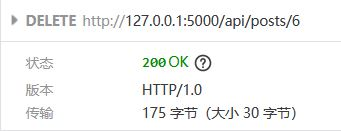
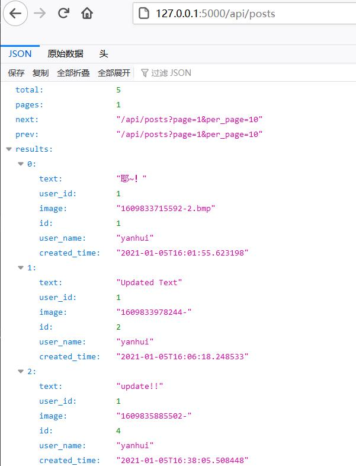
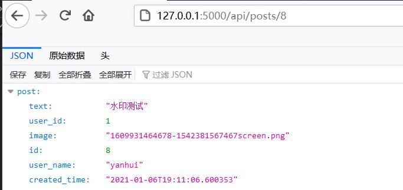

# Learn Flask the Hard Way - Report

## 启动方法

如果需要修改虚拟环境的存储位置，可以设置环境变量`WORKON_HOME`
```cmd
learn_flask_the_hard_way\> pipenv install
learn_flask_the_hard_way\> pipenv shell

(learn_flask_the_hard_way-wSaOEgXc) learn_flask_the_hard_way> cd 0x09_finished
(learn_flask_the_hard_way-wSaOEgXc) learn_flask_the_hard_way\0x09_finished> set FLASK_APP=app
(learn_flask_the_hard_way-wSaOEgXc) learn_flask_the_hard_way\0x09_finished>
set FLASK_ENV=development
(learn_flask_the_hard_way-wSaOEgXc) learn_flask_the_hard_way\0x09_finished> flask run
```

## 分析与初始化

- 目录结构
    ```bash
    0x09_finished
    ├─app
    │  ├─__init__.py
    │  ├─application.py
    │  ├─blueprints.py
    │  ├─extensions.py
    │  ├─auth
    │  │  ├─forms.py    # 定义登录表单类
    │  │  └─views.py
    │  ├─flask_adminlte # 后台管理框架 AdminLTE 的 Flask 扩展
    │  ├─post   # 定义 Post 对象
    │  ├─public
    │  ├─resources  # 推文相关 API
    │  ├─static
    │  │  ├─css
    │  │  └─js
    │  ├─templates  # 前端模板自定义部分
    │  │  ├─base.html
    │  │  ├─home.html
    │  │  └─auth
    │  │      └─login.html
    │  ├─user   # 定义 User 对象
    │  └─utils
    │     ├─paginate.py
    │     └─security.py
    └─config.py # 路径、密钥等配置信息，提供针对生产、开发等不同模式下的配置
    ```
- 创建数据库表
    ```cmd
    (learn_flask_the_hard_way-wSaOEgXc) learn_flask_the_hard_way\0x09_finished> flask shell
    >>> from app.extensions import db
    >>> db.create_all()
    ```
- 根据`create_admin`的定义创建管理员用户
    ```cmd
    (learn_flask_the_hard_way-wSaOEgXc) learn_flask_the_hard_way\0x09_finished> flask user create-admin root@admin.com yanhui pass
    ```
- 首页主要功能【似乎不小心绕过了图片检查(ŏωŏ)】
  - 提交文本和图片
  - 显示历史提交的文本和图片内容


- 可通过 API 编辑、删除推文和获取推文信息

### 推文编辑 API

```bash
$ curl 'http://127.0.0.1:5000/api/posts/2'
{
    "post": {
        "text": "Origin Text",
        "user_id": 1,
        "image": "1609833978244-",  # 这里其实没有图片
        "id": 2,
        "user_name": "yanhui",
        "created_time": "2021-01-05T16:06:18.248533"
    }
}
$ curl 'http://127.0.0.1:5000/api/posts/2' -X PUT -H 'Content-Type: application/json' --data-raw '{"text":"Updated Text"}'
{
    "msg": "post updated",
    "post": {
        "text": "Updated Text",
        "user_id": 1,
        "image": "1609833978244-",
        "id": 2,
        "user_name": "yanhui",
        "created_time": "2021-01-05T16:06:18.248533"
    }
}
```

### 删除推文 API



### 获取推文信息 API

- 获取全部推文信息<br>
<br>
- 获取指定推文信息<br>


## 代码改写

### 由于版本更新导致的变更

- 自 *3.0.0b7* 版本后，`Schema.load`的返回值从`(data, errors)`元组修改为经过反序列化的数据，如果出错将触发`ValidationError`
  - 参阅：[Marshmallow.Schema.load](https://marshmallow.readthedocs.io/en/stable/api_reference.html#marshmallow.Schema.load)
- 修复`resources/post.py`中类`PostResource`下的`put()`函数的 BUG
    ```py
    # Origin
    post, errors = schema.load(request.json, instance=post)
    if errors:
        return errors, 422

    # Fixed
    try:
        # instance: Optional existing instance to modify
        update_value = schema.load(request.json, instance=post)
        # 注：此处未对数据库对象 post 进行操作
    except marshmallow.ValidationError:
        return 422
    ```

### 上传图片检查机制修改

无论是否上传图片，`image`参数都可以获取到，因此修改为通过文件名判断
```py
image = args.get('image')
if image.filename == '':
    return {'msg': 'you must post file.'}, 422
```

### 水印嵌入与提取

- 从[ anjingcuc /
covert_communication ](https://github.com/anjingcuc/covert_communication)获取图片水印相关函数并置于`app/utils/watermark.py`中
- 更新`Pipfile`，添加依赖项`opencv-python`
- `home.html`中添加水印表单项
    ```html
    <div class="form-group">
        <textarea name="watermark" class="form-control" rows="1" placeholder="输入图片水印文本 ..."></textarea>
    </div>
    ```
- 保存图片后，进行水印嵌入
    ```py
    image_path = str(Path(current_app.config['UPLOAD_FOLDER']) / file_name)
    image.save(image_path)

    watermark = args.get('watermark')
    if watermark:
        embed_watermark(image_path, watermark, image_path)
    ```
- 增加一个 API 用作水印提取
- 水印嵌入效果<br>

- 水印提取
    ```bash
    $ curl 'http://127.0.0.1:5000/api/extract/8'
    {
        "extract_text": "Testing"
    }
    ```